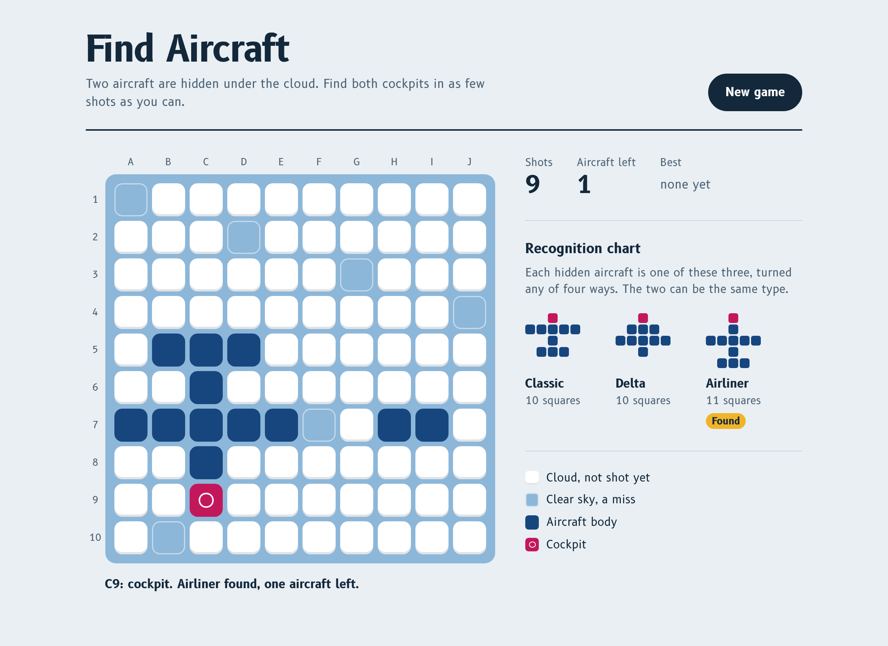

# Find Aircraft

Two aircraft are hidden under a 10 × 10 layer of cloud. Find both cockpits in as few shots as you can.

**[Play it here](https://ilovehhhyn.github.io/find-aircraft/)**



This is a remake of [npes87184/find-aircraft](https://github.com/npes87184/find-aircraft), a pencil-and-paper style deduction game. This version adds three aircraft shapes that are dealt at random, a redesigned board, keyboard play, and a fly-past when you find both aircraft.

## Rules

### Goal

Hit the **cockpit** of both hidden aircraft. Your score is the number of shots you took, so a lower score is better.

### Setup

At the start of every game, two aircraft are placed at random on the grid.

- Each aircraft is one of the three shapes below. The shape is chosen at random and separately for each aircraft, so the two may be different types or the same type.
- Each aircraft points up, right, down or left.
- The two aircraft never overlap, but they may touch.
- Every aircraft has exactly one cockpit, which is the square at its nose.

### The three shapes

`H` is the cockpit and `O` is a body square. Each shape is drawn here with its nose pointing up.

```
  Classic        Delta        Airliner
 10 squares    10 squares    11 squares

     H             H             H
   OOOOO          OOO            O
     O           OOOOO         OOOOO
    OOO            O             O
                                OOO
```

The same chart is shown next to the board while you play.

### Taking a shot

Pick any square that is still covered by cloud. One of three things happens:

| Result | What you see | What it means |
| --- | --- | --- |
| Miss | The cloud clears to open sky | No aircraft occupies this square |
| Body hit | A blue square | Part of an aircraft is here, but not its cockpit |
| Cockpit hit | A magenta square with a ring | That aircraft is found |

When you hit a cockpit, the rest of that aircraft is uncovered for you. Those uncovered squares are free: they do not add to your shot count. Shooting a square that is already revealed does nothing and costs nothing.

### Winning

The game ends when both cockpits have been hit. The remaining cloud clears, both aircraft pulse from nose to tail, and one aircraft flies across the board. Your best (lowest) score is remembered in your browser.

### Tips

- Every shape has exactly one row of five squares, its wing, and the cockpit always lies on the line through the wing's centre. It is one square ahead of the wing on a Classic and two squares ahead on a Delta or an Airliner.
- Once you have a wing, the square just ahead of its centre tells you the type. A cockpit there means a Classic. A body square there means a Delta or an Airliner, and the cockpit is one square further on.
- A row of exactly three squares is either a tail (Classic, Airliner) or the front half of a Delta's wing, so it does not tell you which way the aircraft points on its own.
- A found aircraft tells you where the other one is not, because aircraft cannot overlap.

## Controls

- **Mouse or touch:** click or tap a square to shoot it.
- **Keyboard:** press Tab to reach the board, move with the arrow keys, and press Enter or Space to shoot.
- **New game:** deals two new aircraft at any time.

## Run it locally

There is no build step and nothing to install. Open `index.html` in a browser, or serve the folder:

```sh
python3 -m http.server 8000
# then visit http://localhost:8000
```

To run the tests for the game rules (Node 18 or newer):

```sh
node --test
```

## How the code is organised

| File | Purpose |
| --- | --- |
| `js/game.js` | The rules: shapes, random placement and shot resolution. No DOM access, so it runs in Node for the tests. |
| `js/ui.js` | Draws the board, handles input and plays the animations. |
| `css/style.css` | Layout, colours and animation. |
| `tests/game.test.js` | Tests for placement and scoring. |

To add or change a shape, edit the `SHAPES` list in `js/game.js`. Each shape is a list of `[row, column]` offsets from the cockpit with the nose pointing up, and the first offset must be the cockpit `[0, 0]`. The board, the chart and the placement logic all read from that list.

## Credits

The game idea and the Classic shape come from [npes87184/find-aircraft](https://github.com/npes87184/find-aircraft) by Yu-Chen Lin, which is MIT licensed. The code here is written from scratch. Text is set in [B612](https://b612-font.com/), the typeface Airbus commissioned for cockpit displays.

## License

[MIT](LICENSE)
